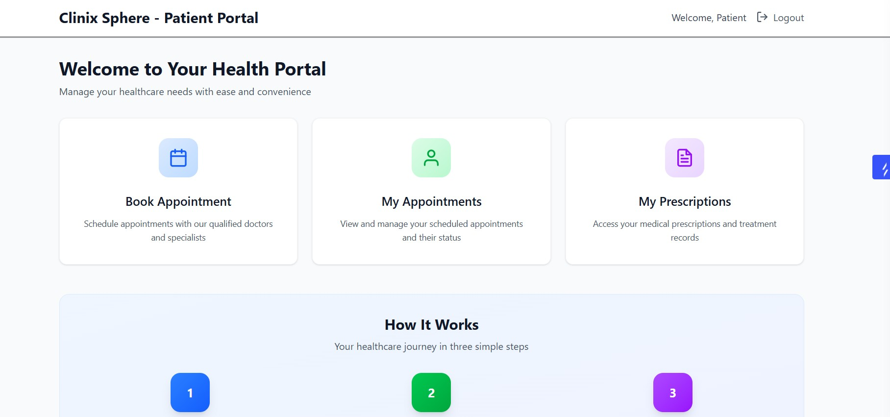
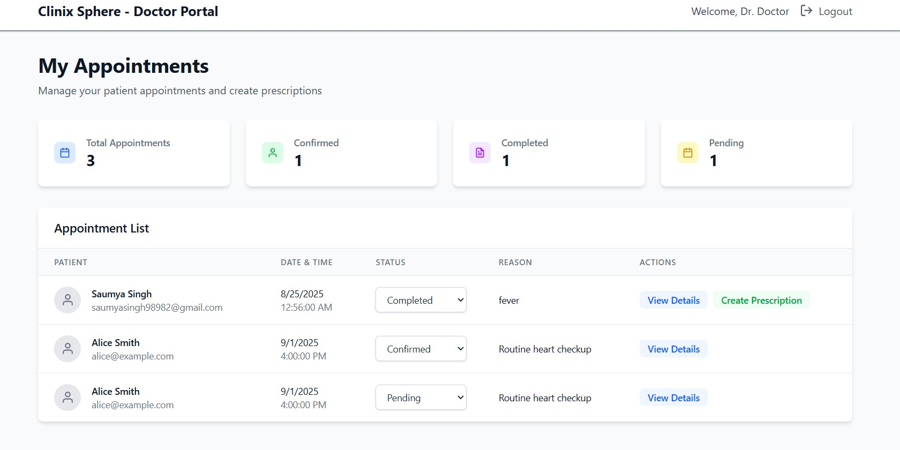
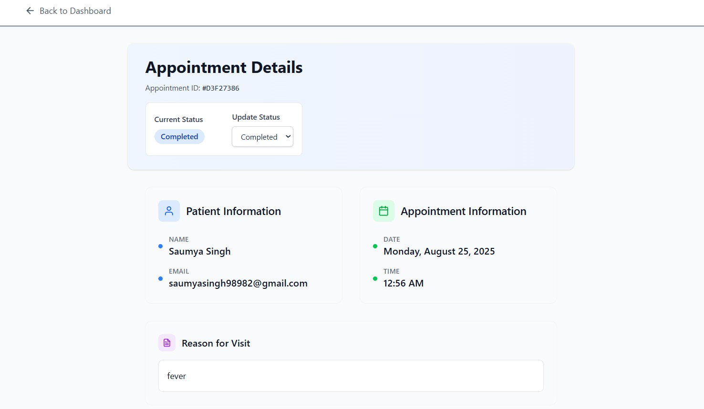
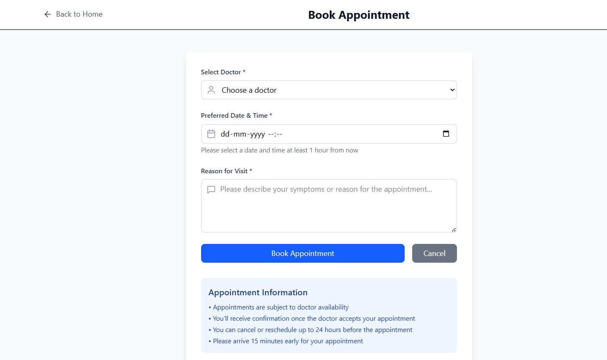
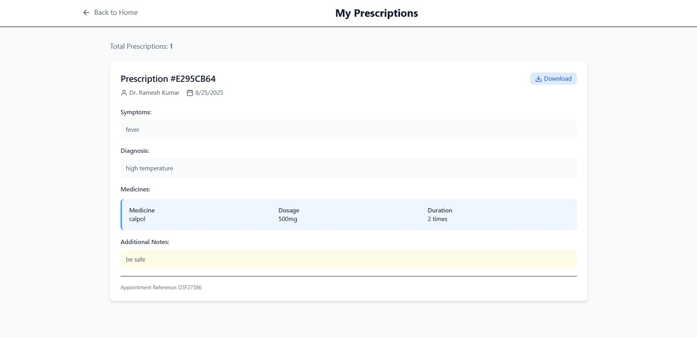

# Clinix Sphere - Doctor-Patient Appointment System

A comprehensive healthcare management system with separate dashboards for doctors and patients, featuring appointment booking and digital prescription management.

## Features

### For Patients
- **User Registration & Authentication** - Secure JWT-based login system
- **Book Appointments** - View available doctors and schedule appointments
- **Appointment Management** - Track appointment status and history
- **Digital Prescriptions** - View prescriptions after completed appointments
- **Responsive Design** - Works seamlessly on desktop and mobile devices

### For Doctors
- **Doctor Dashboard** - Manage appointments and patient records
- **Appointment Management** - View, confirm, and complete appointments
- **Digital Prescriptions** - Create detailed prescriptions with medicines
- **Patient Records** - Access patient information and appointment history
- **Status Updates** - Update appointment status in real-time

## Project Structure

```
Clinix Sphere/
├── Server/                    # Backend API
│   ├── controllers/          # Business logic controllers
│   ├── models/              # MongoDB models
│   ├── routes/              # API route handlers
│   ├── middleware/          # Authentication middleware
│   ├── db.js               # Database connection
│   ├── index.js            # Main server file
│   └── package.json        # Backend dependencies
├── doctors/                 # Doctor's React Dashboard
│   ├── src/
│   │   ├── components/     # React components
│   │   ├── App.jsx         # Main app component
│   │   └── main.jsx        # App entry point
│   ├── index.html          # HTML template
│   └── package.json        # Frontend dependencies
├── patients/                # Patient's React Dashboard
│   ├── src/
│   │   ├── components/     # React components
│   │   ├── App.jsx         # Main app component
│   │   └── main.jsx        # App entry point
│   ├── index.html          # HTML template
│   └── package.json        # Frontend dependencies
└── README.md               # Project documentation
```

## Technology Stack

### Backend
- **Node.js** - Runtime environment
- **Express.js** - Web framework
- **MongoDB** - NoSQL database
- **Mongoose** - MongoDB object modeling
- **JWT** - Authentication
- **bcryptjs** - Password hashing

### Frontend (Doctors & Patients)
- **React 19** - UI framework
- **Vite** - Build tool and dev server
- **Tailwind CSS** - Utility-first CSS framework
- **React Router** - Client-side routing
- **Axios** - HTTP client
- **React Hot Toast** - Toast notifications
- **Lucide React** - Icon library

## Prerequisites

Before running this project, make sure you have:
- **Node.js** (v16 or higher)
- **MongoDB** (local installation or MongoDB Atlas)
- **npm** or **yarn** package manager

## 📸 Screenshots

### Patient Dashboard

*Patient login interface with clean, modern design*


*Patient dashboard showing appointment booking and management*

### Doctor Dashboard

*Doctor login interface with professional medical theme*


*Doctor dashboard for managing appointments and patient records*


*Digital prescription creation interface*

## 🚀 Installation & Setup

### 1. Clone the Repository
```bash
git clone <repository-url>
cd clinix-sphere
```

### 2. Backend Setup
```bash
# Navigate to server directory
cd Server

# Install dependencies
npm install

# Create environment file
cp .env.example .env

# Edit .env file with your configuration
# Required variables:
# PORT=4000
# MONGO_URI=mongodb://localhost:27017/clinix_sphere
# JWT_SECRET=your_secure_jwt_secret_key
```

### 3. Database Setup
```bash
# Make sure MongoDB is running locally, or use MongoDB Atlas
# Update MONGO_URI in .env accordingly
```

### 4. Start Backend Server
```bash
# Development mode
npm run dev

# Production mode
npm start
```

The backend will be running at `http://localhost:4000`

### 5. Doctor Dashboard Setup
```bash
# Navigate to doctors directory
cd ../doctors

# Install dependencies
npm install

# Start development server
npm run dev
```

The doctor dashboard will be running at `http://localhost:5173`

### 6. Patient Dashboard Setup
```bash
# Navigate to patients directory
cd ../patients

# Install dependencies
npm install

# Start development server
npm run dev
```

The patient dashboard will be running at `http://localhost:3001`

## Configuration

### Environment Variables

Create `.env` files in both `Server` and frontend directories:

**Backend (.env):**
```env
PORT=4000
MONGO_URI=mongodb://localhost:27017/clinix_sphere
JWT_SECRET=your_secure_random_jwt_secret_key
```

**Frontend (.env):**
```env
VITE_API_URL=http://localhost:4000
```

## Usage Guide

### For Patients
1. **Register** - Create a new patient account
2. **Login** - Use your credentials to access the patient portal
3. **Book Appointment** - Select a doctor and preferred date/time
4. **View Appointments** - Track your appointment status
5. **View Prescriptions** - Access prescriptions after completed appointments

### For Doctors
1. **Register/Login** - Access the doctor dashboard
2. **View Appointments** - See all scheduled appointments
3. **Update Status** - Confirm, complete, or cancel appointments
4. **Create Prescriptions** - Add prescriptions for completed appointments
5. **Manage Records** - Access patient information and history

## API Endpoints

### Authentication
- `POST /auth/register` - Register new user (doctor/patient)
- `POST /auth/login` - Login user

### Appointments
- `POST /app/book` - Book new appointment
- `GET /app/my-appointments` - Get patient appointments
- `GET /doctors/appointments` - Get doctor appointments
- `PATCH /doctors/appointments/:id/status` - Update appointment status

### Doctors
- `GET /doctors/all` - Get all doctors
- `GET /doctors/appointments` - Get doctor's appointments

### Prescriptions
- `POST /prescriptions/:appointmentId` - Create prescription
- `GET /prescriptions/:appointmentId` - Get prescription by appointment
- `GET /prescriptions/patient/my-prescriptions` - Get patient prescriptions
- `GET /prescriptions/doctor/my-prescriptions` - Get doctor prescriptions

## 🎨 Features Overview

### Patient Dashboard
- **Modern UI** - Clean, intuitive interface
- **Appointment Booking** - Easy scheduling with doctor selection
- **Status Tracking** - Real-time appointment status updates
- **Prescription Access** - Digital prescription management
- **Responsive Design** - Mobile-friendly experience

### Doctor Dashboard
- **Appointment Management** - Comprehensive appointment overview
- **Patient Records** - Access to patient information
- **Prescription Creation** - Detailed prescription forms
- **Status Updates** - Efficient appointment workflow
- **Professional Interface** - Streamlined medical workflow

## 🧪 Testing

### Backend Testing
```bash
cd Server
npm test
```

### Frontend Testing
```bash
# Doctors Dashboard
cd doctors
npm run build

# Patients Dashboard
cd patients
npm run build
```

## 🚀 Deployment

### Backend Deployment
```bash
cd Server
npm run build
npm start
```

### Frontend Deployment
```bash
# Build for production
npm run build

# Serve built files
npm run preview
```

## 🤝 Contributing

1. Fork the repository
2. Create a feature branch
3. Make your changes
4. Add tests if applicable
5. Submit a pull request

## 📝 License

This project is licensed under the MIT License - see the LICENSE file for details.

## 📧 Support

For support and questions:
- Create an issue in the repository
- Contact the development team

## 🔄 Version History

### v1.0.0
- Initial release
- Basic appointment booking system
- Doctor and patient dashboards
- Digital prescription management
- JWT authentication
- Responsive design

---

**Note:** This is a comprehensive healthcare management system designed for educational and demonstration purposes. In a production environment, additional security measures, data validation, and compliance with healthcare regulations would be required.
